# Acesso desde o QGIS

Esta secção ilustra como aceder a dados publicados em OGC API, através da aplicação cliente [QGIS](https://qgis.org/).

A lista de clientes que podem aceder a dados publicados em OGC API pode ser consultada nos repositórios de GitHub de cada Standard (por exemplo, [OGC API - Features](https://github.com/opengeospatial/ogcapi-features/tree/master/implementations/clients)) e inclui aplicações como LeafLet, OpenLayers, GDAL ou ArcGIS.

!!! info
    
    Para as demonstrações abaixo, foi usada a LTR do QGIS, que no momento em que este manual foi escrito é a 3.40.6. Mais detalhes podem ser consultados na tabela abaixo:

    <table width='100%' align='center'><tr><td>QGIS version</td><td>3.40.6-Bratislava</td></tr><tr><td>QGIS code revision</td><td><a href="https://github.com/qgis/QGIS/commit/5d7f6a3e265">5d7f6a3e265</a></td></tr><tr><td colspan="2">&nbsp;</td></tr><tr><td colspan="2"><b>Libraries</b></td></tr><tr><td>Qt version</td><td>5.15.13</td></tr><tr><td>Python version</td><td>3.12.3</td></tr><tr><td>GDAL version</td><td>3.8.4</td></tr><tr><td>PROJ version</td><td>9.4.0</td></tr><tr><td>EPSG Registry database version</td><td>v11.004 (2024-02-24)</td></tr><tr><td>GEOS version</td><td>3.12.1-CAPI-1.18.1</td></tr><tr><td>SQLite version</td><td>3.45.1</td></tr><tr><td>PostgreSQL client version</td><td>16.8 (Ubuntu 16.8-0ubuntu0.24.04.1)</td></tr><tr><td>SpatiaLite version</td><td>5.1.0</td></td></tr><tr><td>QWT version</td><td>6.1.4</td></tr><tr><td>QScintilla2 version</td><td>2.14.1</td></tr><tr><td>OS version</td><td>Ubuntu 24.04.2 LTS</td></tr><tr><td colspan="2">&nbsp;</td></tr></table>

## OGC API - Features

Para adicionar um layer do tipo "OGC API - Features", pode ser utilizado o browser do lado esquerdo, carregando no item "WFS/OGC API - Features" para chamar o context menu, e escolhendo "Nova Ligação". 

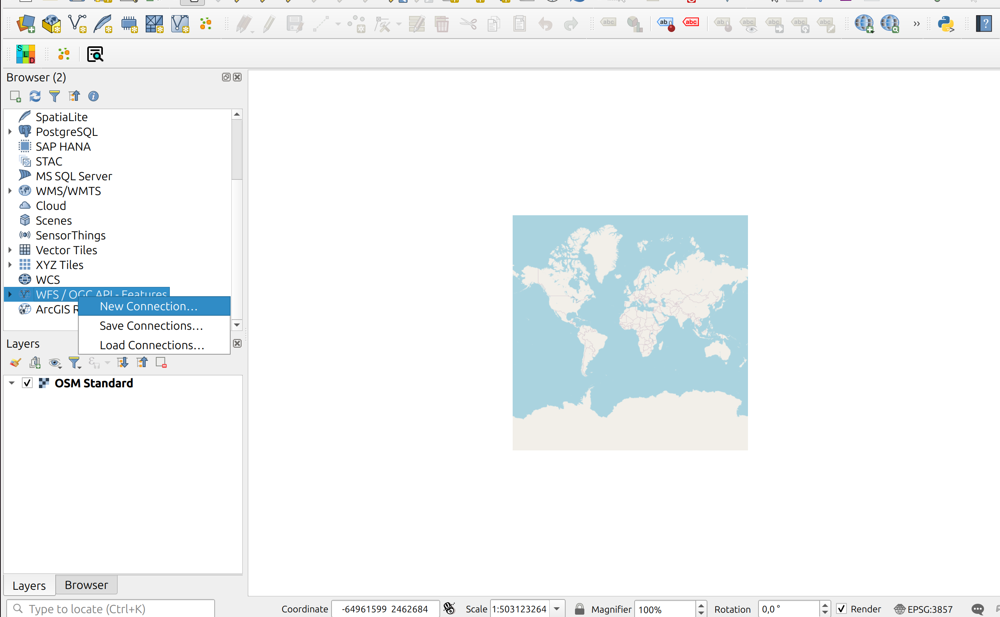

No passo seguinte, é aberta uma caixa de configuração para introduzir os dados da ligação. Na secção `url` deve ser introduzido o url da Landing Page da OGC API: [https://ogcapi.dgterritorio.gov.pt/](https://ogcapi.dgterritorio.gov.pt/). As opcões de WFS são facultativas.

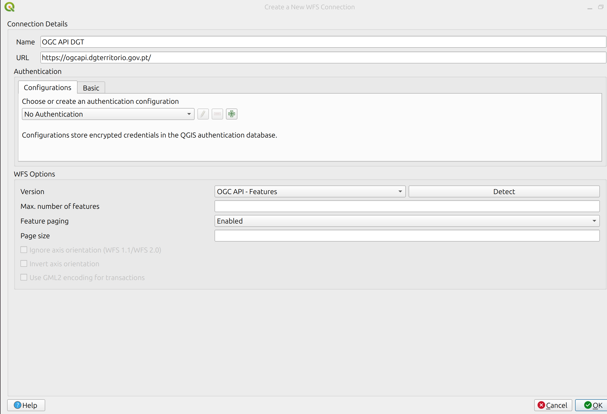

Ao pressionar `ok` para fechar a caixa anterior, uma nova ligação aparecerá listada debaixo da secção "WFS/OGC API - Features", no browser panel. Ao carregar nesse item para expandir-lo irão aparecer todas as colecções de OGC API - Features, disponíveis no servidor.

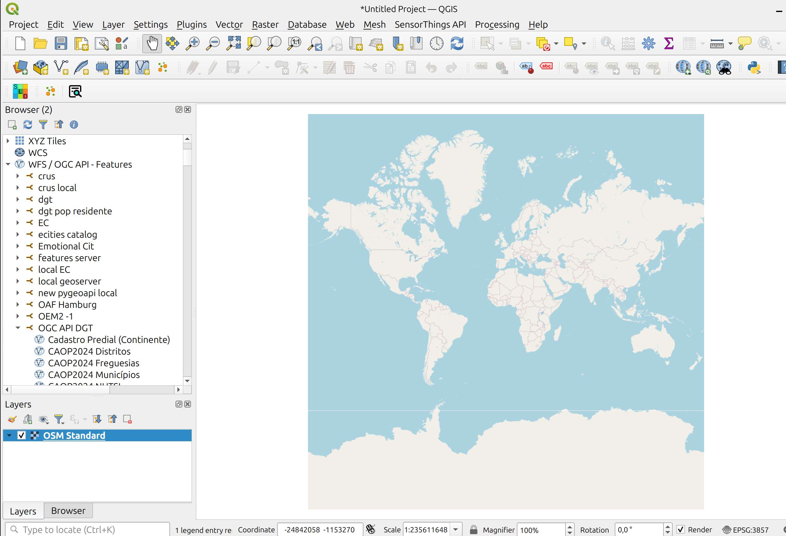

Qualquer uma destas colecções pode ser adicionada ao QGIS como layer, fazendo duplo click, ou carregando nela para chamar o menu de contexto e escolhendo "Add layer to project".

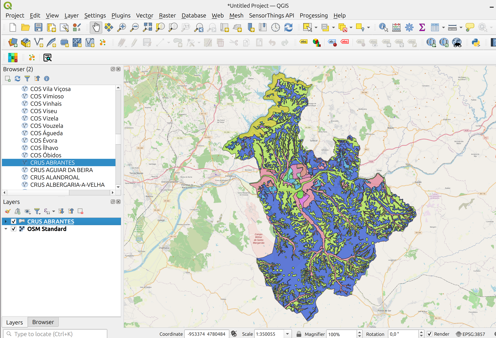

!!! tip
    
    As colecções OGC API - Features também podem ser adicionadas através do top menu "Layer", escolhendo "Add Layer" e "Add WFS/OGC API - Features Layer".

    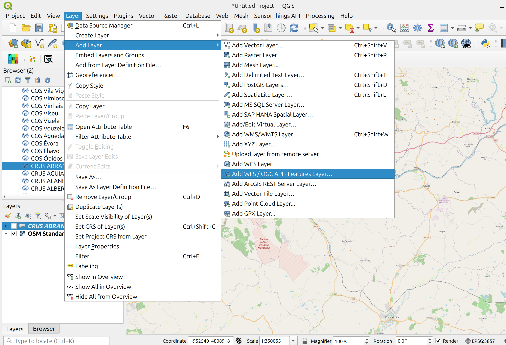

## OGC API - Tiles

O QGIS permite adicionar tiles vectoriais com o formato OGC API - Tiles. No browser panel do lado esquerdo, carregar no item "Vector Tiles" para chamar o context menu e seleccionar "New generic connection".

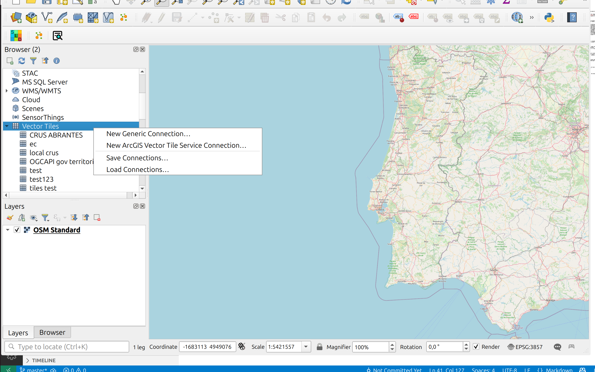

Na caixa de configuração deve-se indicar qual é o "source url" da colecção.

!!! tip
    
    Para obter "source url" da colecção pode-se consultar o endpoint de tileset metadata. Depois de identificar a colecção de interesse, através do [endpoint de colecções](https://ogcapi.dgterritorio.gov.pt/collections?f=html), carregar nessa colecção para obter a página da colecção. Por exemplo, se quiseremos os metadados de colecção de "CRUS ABRANTES", podemos carregar nesse link que nos leva até: [https://ogcapi.dgterritorio.gov.pt/collections/crus_abrantes](https://ogcapi.dgterritorio.gov.pt/collections/crus_abrantes). A última parte do url - `crus_abrantes`- é o nome da colecção.

    Para aceder ao tileset metadata, podemos substituir o `NOME` neste url, por `crus_abrantes`:

    [https://ogcapi.dgterritorio.gov.pt/collections/NOME/tiles/WebMercatorQuad/metadata](https://ogcapi.dgterritorio.gov.pt/collections/crus_abrantes/tiles/WebMercatorQuad/metadata)

    

    Acedendo a url podemos consultar o Tile URL template. 

    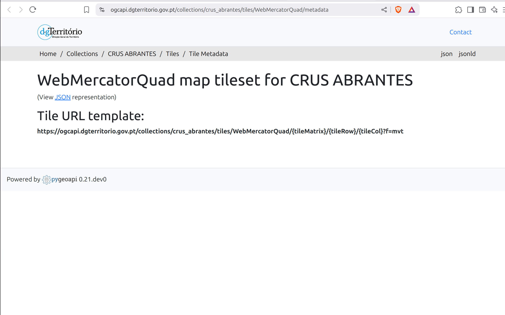

    Podemos copiar este valor para o "source url" do QGIS, substituindo `tileMatrix` por `z`, `tileRow` por `y` e `tileCol` por `x`: 

    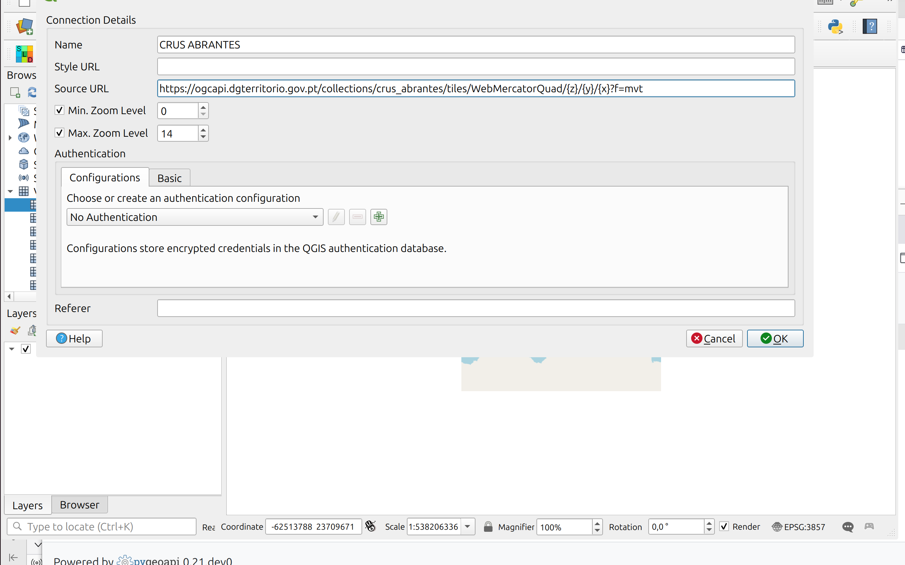

Depois de aceitar esta configuração, a colecção irá aparecer listada debaixo do item "Vector Tiles". Ela pode ser adicionada ao mapa, carregando para obter o context menu, e depois seleccionando "Add layer to project".

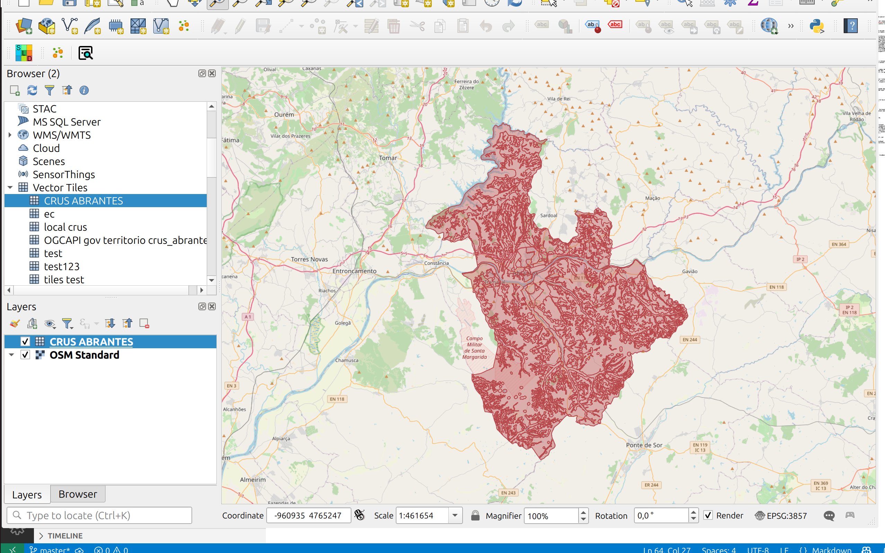

## OGC API - Maps

A infraestrutura OGC API da DGT disponibiliza duas colecções como OGC API - Maps:
"OrtoSat 30 cm - Portugal Continental - 2023": Cor Verdadeira e Cor Falsa. Para acceder a qualquer uma destas colecções, começamos por identificar o endpoint da colecção através do [endpoint de colecções](https://ogcapi.dgterritorio.gov.pt/collections?f=html). Por exemplo para o tema "Cor Verdadeira":

* [https://ogcapi.dgterritorio.gov.pt/collections/ortos-rgb](https://ogcapi.dgterritorio.gov.pt/collections/ortos-rgb)

Através do menu "Layer", seleccionar a opção "Add Layer" e "Add Raster Layer".

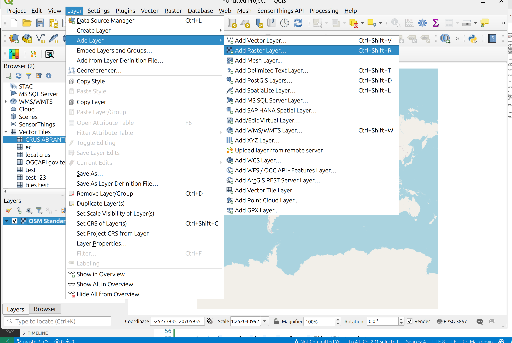

 Na caixa de configuração, seleccionar o radio button "OGC API", que irá expandir um menu com opções de configuração.

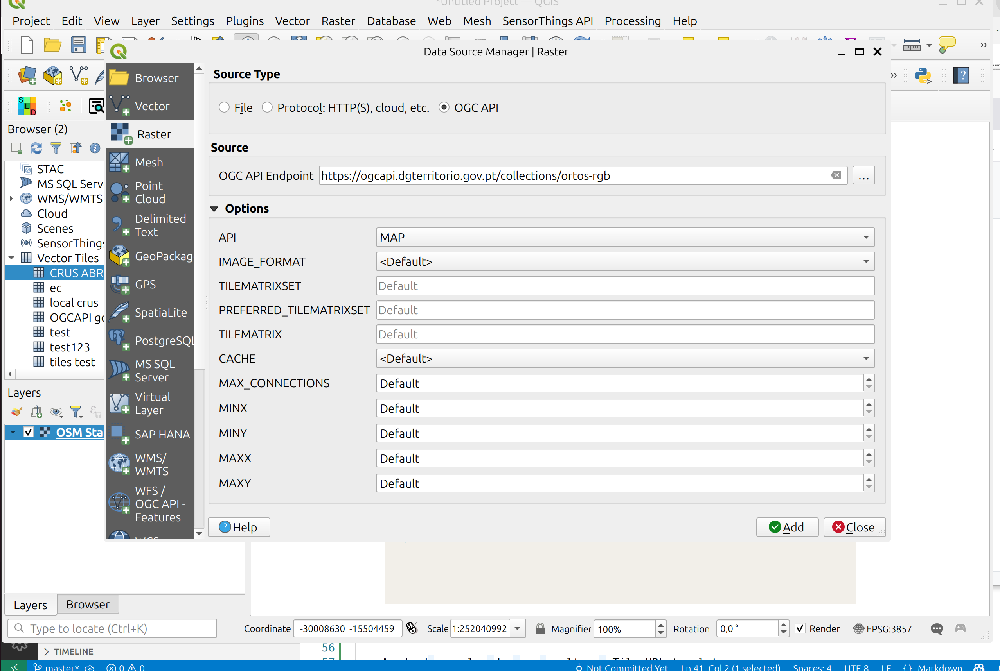

Na secção "OGC API - endpoint", deve-se preencher o url da colecção que identificámos acima e na `API`, escolher `map`. Todas as outras configurações são opcionais. Depois de aceitar esta configuração, a colecção será adicionada ao mapa.

