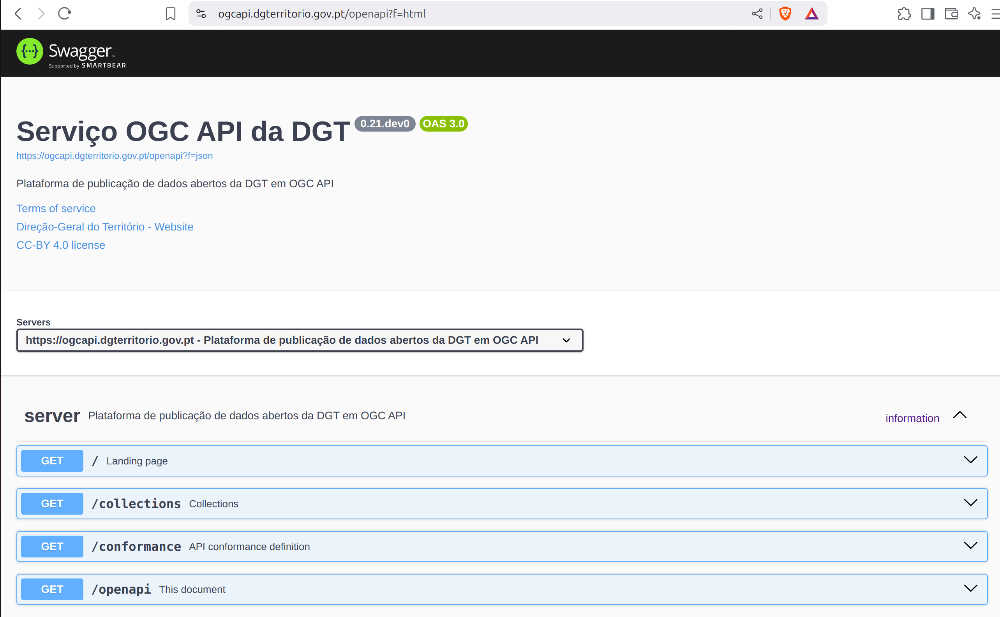
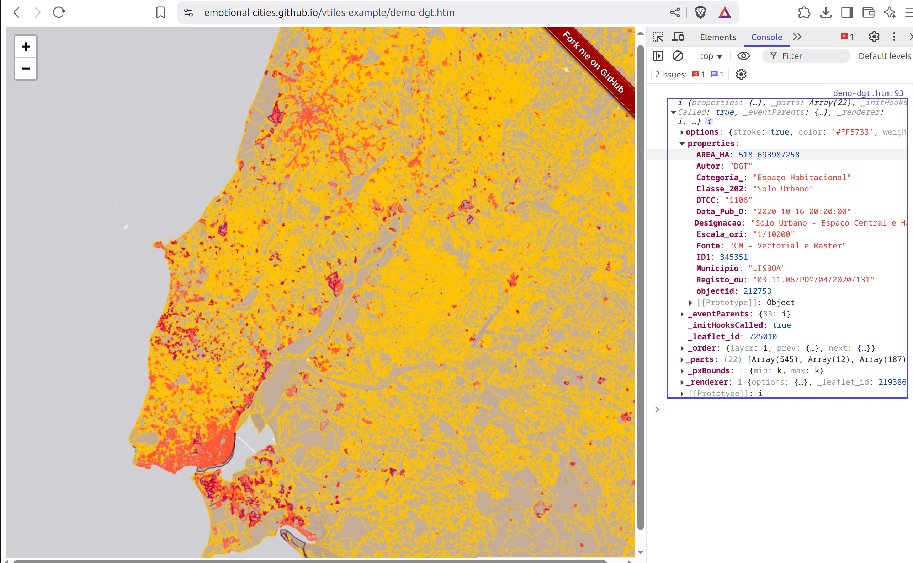

# Descrição

!!! warning
    
    As descrições de funcionalidade dos Standards OGC apresentadas nesta secção cobrem apenas alguns aspectos e não dispensam a leitura completa dos Standards aqui referidos: OGC API - Common, OGC API Features e OGC API - Tiles. Os links para esses documentos podem ser encontrados directamente no texto, ou na secção [Referências e Recursos de Aprendizagem](./recursos.md#ogc-api) 

## Introdução

A disponibilização e reutilização dos dados abertos, conforme estabelecido na Diretiva (UE) 2019/1024 do Parlamento Europeu e do Conselho, exige a adoção de novos procedimentos nomeadamente a nível da disponibilização e reutilização da informação do sector público.

Os dados geográficos abertos devem ser disponibilizados gratuitamente, em formato legível por máquinas e por meio de Interfaces de Programação de Aplicações (IPA/API).
A [Open Geospatial Consortium](https://www.ogc.org/) (OGC) tem vindo nos últimos anos a desenvolver novos Serviços de Dados Geográficos (SDG) para a WEB através de API, denominadas de [OGC API](https://ogcapi.ogc.org/). Estas API foram concebidas para facilitar a qualquer pessoa a disponibilização e a utilização de dados geográficos na WEB, bem como a integração desses dados com qualquer outro tipo de informação. Estas normas baseiam-se no legado das normas de serviços WEB da OGC (WCS, WMS, WMTS, WFS, WPS, etc.), mas definem API centradas em recursos que tiram partido das práticas modernas de desenvolvimento WEB como [REST](https://en.wikipedia.org/wiki/REST) e [JSON](https://en.wikipedia.org/wiki/JSON), tornando-as compatíveis com uma grande variedade de aplicações e plataformas.

Estas normas promovem a interoperabilidade, a escalabilidade e a segurança, facilitando a integração e a análise de dados geográficos em tempo real.

Assim, a Direção-Geral do Território (DGT) está a criar uma plataforma, que permite disponibilizar os dados geográficos registados no SNIG e com políticas de dados abertas, através de OGC API.

## Acesso

A infraestrutura de dados geospaciais OGC API da DGT oferece uma API com múltiplos endpoints que permitem obter dados geospaciais, mas também aceder a metadados sobre o serviço em si e as coleções publicadas. A documentação de todos os endpoints publicados está disponível (de acordo com o Standard) no [OpenAPI](https://www.openapis.org/) endpoint:

[https://ogcapi.dgterritorio.gov.pt/openapi](https://ogcapi.dgterritorio.gov.pt/openapi)

Para além da documentação dos endpoints, de acordo com o Standard [OGC API - Common - Part 1: Core](https://docs.ogc.org/is/19-072/19-072.html), a API oferece uma *Landing Page* (ou página de início) e uma *Conformance Declaration* (ou declaração de conformidade):

* [https://ogcapi.dgterritorio.gov.pt/](https://ogcapi.dgterritorio.gov.pt/): *Landing Page*, ponto de partida para usar a API, com todos os links necessários para aceder a outros recursos.
* [https://ogcapi.dgterritorio.gov.pt/conformance](https://ogcapi.dgterritorio.gov.pt/conformance): *Conformance Declaration*, lista de todos os módulos OGC API suportados neste serviço. 

De acordo com o candidato a Standard [OGC API - Common - Part 2](https://docs.ogc.org/DRAFTS/20-024.html) esta API apresenta também um endpoint de  *Collections* (colecções), onde são apresentadas todas as colecções publicadas por este serviço.

* [https://ogcapi.dgterritorio.gov.pt/collections](https://ogcapi.dgterritorio.gov.pt/collections): *Collections*, lista de colecções publicadas neste serviço.

!!! quote

    "Geospatial resources are typically packaged into sets or collections of related resources. A single API may provide access to a large number of collections. This API-GeoData standard provides a means of organizing these collections and defines operations for the discovery and selection of individual collections." (OGC API - Common - Part 2: Geospatial Data Standard)

## Formatos da Resposta

Os Standards OGC API oferecem diferentes formatos através de um mecanismo de [negociação de conteúdos](https://en.wikipedia.org/wiki/Content_negotiation). Desta forma, uma API poderá obter uma resposta em formato JSON, enquanto que um browser poderá obter uma resposta em formato HTML. A representação alternativa dos endpoints em formato HTML é apenas uma conveniência e não deve ser considerada um substituto de uma aplicação cliente, que é a forma recomendada de aceder aos endpoints. Na secção  [Acesso desde o QGIS](clientes.md) é apresentado um exemplo de como aceder ao serviço usando uma aplicação cliente (QGIS). 

!!! tip
    
    A pygeoapi apresenta um mecanismo para forçar o formato da resposta, através do parâmetro `f`. Para obter uma resposta em formato HTML, deve ser usado `f=html`:

    [https://ogcapi.dgterritorio.gov.pt/?f=html](https://ogcapi.dgterritorio.gov.pt/?f=html)

    Para obter a mesma resposta em formato JSON, deve ser usado `f=json`:

     [https://ogcapi.dgterritorio.gov.pt/?f=json](https://ogcapi.dgterritorio.gov.pt/?f=json)

     Este padrão é válido para todos os endpoints da OGC API.

## Colecções Publicadas

A DGT disponibliza 569 colecções em OGC API.

As colecções "OrtoSat 30 cm - Portugal Continental - 2023" ([Cor Verdadeira](https://ogcapi.dgterritorio.gov.pt/collections/ortos-rgb) e [Cor Falsa](https://ogcapi.dgterritorio.gov.pt/collections/ortos-irg)) estão publicadas como [OGC API - Maps](https://docs.ogc.org/is/20-058/20-058.html). 

!!! info
    
    OGC API - Maps segue as pegadas do Web Map Service (WMS) da OGC, possibilitando ás aplicações clientes pedir mapas com informação geospacial na web, usando parâmetros específicos (bounding box, crs, etc).

O [Cadastro Predial](https://ogcapi.dgterritorio.gov.pt/collections/cadastro), a [Carta do Regime de Uso do Solo (CRUS)](https://ogcapi.dgterritorio.gov.pt/collections/crus), a [Carta de Uso e Ocupação do Solo (COS)](https://ogcapi.dgterritorio.gov.pt/collections/cos) e a Carta Administrativa Oficial de Portugal (CAOP) estão publicadas como [OGC API - Features](https://github.com/opengeospatial/ogcapi-features) e [OGC API - Tiles](https://github.com/opengeospatial/ogcapi-tiles). As tiles disponibilizadas são vectoriais usando o formato [Vector Tile da Mapbox](https://github.com/mapbox/vector-tile-spec).

!!! info
    
    [OGC API - Features](https://features.developer.ogc.org/) permite interrogar dados vectoriais na web, independentemente da forma como estes estão armazenados (ficheiro, base de dados SQL, base de dados NoSQL).

!!! info
    
    [OGC API - Tiles](https://tiles.developer.ogc.org/) pode ser considerado um upgrade ao Standard OGC Web Map Tile Service (WMTS), permitindo criar mapas interactivos na web, que funcionam de uma forma eficiente.

    A imagem abaixo mostra um exemplo de uma aplicação de web que produz um mapa interactivo do tema "crus", a partir de um endpoint de OGC AP - Tiles. O código completo pode ser consultado [aqui](https://github.com/emotional-cities/vtiles-example.git).

    

Os temas CRUS e COS foram sub divididos em sub-temas, com base no municipio, resultando em 278 colecções cada.

A CAOP está dividida em 8 colecções, uma para cada unidade admninistrativa ([Municípios](https://ogcapi.dgterritorio.gov.pt/collections/municipios), [Freguesias](https://ogcapi.dgterritorio.gov.pt/collections/freguesias), [Áreas administrativas](https://ogcapi.dgterritorio.gov.pt/collections/area_administrativa), [NUTSI](https://ogcapi.dgterritorio.gov.pt/collections/nuts1), [NUTSII](https://ogcapi.dgterritorio.gov.pt/collections/nuts2), [NUTSIII](https://ogcapi.dgterritorio.gov.pt/collections/nuts3), [Troços](https://ogcapi.dgterritorio.gov.pt/collections/trocos), [Distritos](https://ogcapi.dgterritorio.gov.pt/collections/distritos)).

De acordo com *OGC API - Common - Part 2* o endpoint de *collection* (colecção) contém toda a informação necessária sobre essa colecção, incluindo os links para aceder aos dados e metadados. Por exemplo, para obter os *metadados de colecção* da colecção `crus_abrantes`: 

[https://ogcapi.dgterritorio.gov.pt/collections/crus_abrantes](https://ogcapi.dgterritorio.gov.pt/collections/crus_abrantes)

A partir de aqui, é possível obter os dados em formato OGC API - Features, ou navegar até ao endpoint de tiles:

* [https://ogcapi.dgterritorio.gov.pt/collections/crus_abrantes/items](https://ogcapi.dgterritorio.gov.pt/collections/crus_abrantes/items)
* [https://ogcapi.dgterritorio.gov.pt/collections/crus_abrantes/tiles](https://ogcapi.dgterritorio.gov.pt/collections/crus_abrantes/tiles)

!!! tip
    
    OGC API - Features suporta um parametro de paging, que permite receber um número pre definido de items na resposta. Por defeito, o servidor está configurado para devolver respostas com 100 items. Este limite pode ser forçado através do parâmetro `limit`, até atingir o valor máximo definido no servidor. Por exemplo, para pedir uma resposta que devolva o máximo de 200 items:

    [https://ogcapi.dgterritorio.gov.pt/collections/crus_abrantes/items?limit=200](https://ogcapi.dgterritorio.gov.pt/collections/crus_abrantes/items?limit=200)

## CRS Suportados

Este serviço publica os dados vectoriais em cinco *Coordinate Reference Systems (CRS)*, ou Sistemas de Referência de Coordenadas:

* [http://www.opengis.net/def/crs/OGC/1.3/CRS84](http://www.opengis.net/def/crs/OGC/1.3/CRS84)
* [http://www.opengis.net/def/crs/EPSG/0/4326](http://www.opengis.net/def/crs/EPSG/0/4326)
* [http://www.opengis.net/def/crs/EPSG/0/3857](http://www.opengis.net/def/crs/EPSG/0/3857)
* [http://www.opengis.net/def/crs/EPSG/0/4258](http://www.opengis.net/def/crs/EPSG/0/4258)
* [http://www.opengis.net/def/crs/EPSG/0/3763](http://www.opengis.net/def/crs/EPSG/0/3763)

De acordo com *OGC API - Common - Part 2* esta informação é apresentada no endpoint *collection*  de cada colecção.

