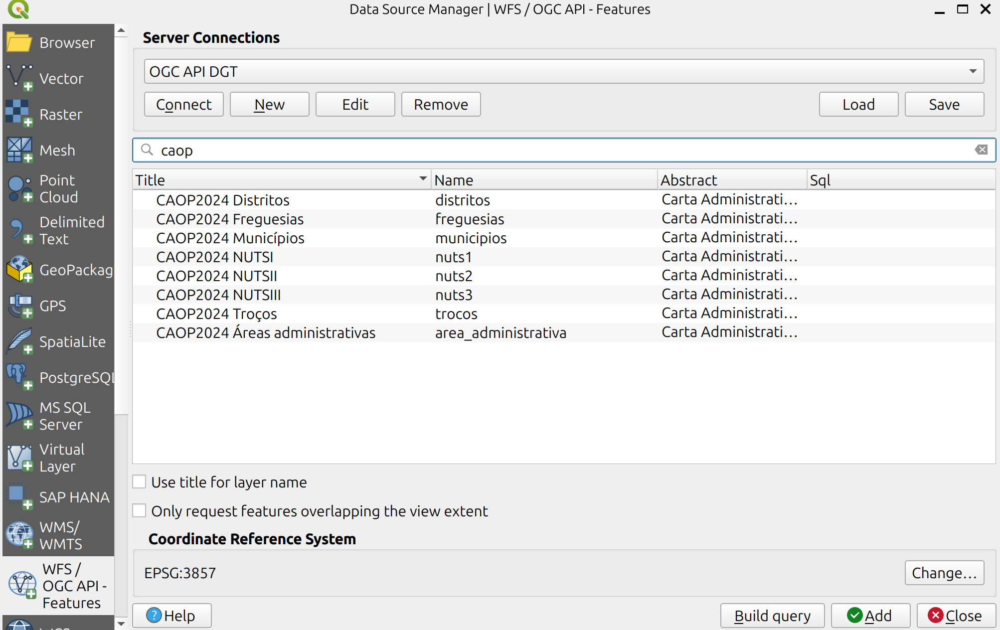
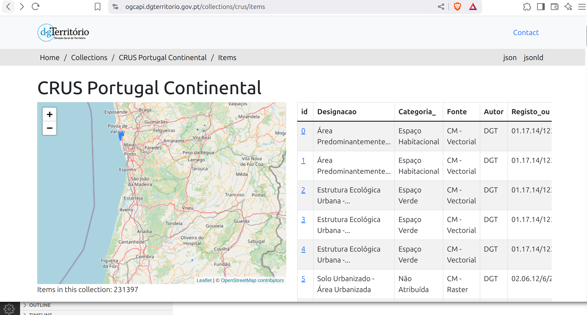

# Perguntas Frequentes

Esta secção compila alguns problemas comuns que podem surgir, e as soluções identificadas. Caso identifiquem outros problemas/soluções que mereçam a pena ser adicionados ou actualizados, podem contribuir utilizando os mecanismos identificados [nesta secção](./contribuir.md).

!!! question

    *Porque é que a representação HTML da OGC API - DGT está em inglês?*
    
    A OGC API da DGT suporta português e inglês, de acordo com a preferência do cliente. A pygeoapi segue um mecanismo Standard de HTTP, que procura satisfazer o header [`Accept-Language`](https://www.w3.org/Protocols/HTTP/HTRQ_Headers.html#z12) do pedido enviado pelo cliente. No caso de aceder á API através de um browser verifique se a língua que tem pre-definida é o inglês, o que explicaria obter uma resposta em inglês. 

!!! tip

    A pygeoapi permite forçar a resposta uma determinada língua, através do parâmetro `lang`. Por exemplo para obter uma resposta em português, independentemente da língua do cliente:

    [https://ogcapi.dgterritorio.gov.pt/?lang=pt](https://ogcapi.dgterritorio.gov.pt/?lang=pt)

!!! question

    *A [página de colecções da OGC API da DGT](https://ogcapi.dgterritorio.gov.pt/collections?f=html) tem centenas de entradas. Como posso filtra-las para encontrar uma entrada específica, por exemplo `caop`?*

    A OGC API da DGT é uma API, desenhada para ser consumida por uma aplicação cliente (como o QGIS). A representação HTML dos endpoints é apenas um exemplo, que permite uma visualização mais simpática que um documento em JSON, mas não apresenta funcionalidades como pesquisas.

!!! tip

    Ao [criar uma ligação no QGIS com o endpoint da OGC API - Features](./clientes.md#ogc-api-features), é possível filtrar as colecções no servidor usando uma string (por exemplo `caop`).

    

!!! question

    *Sei que esta colecção tem mais de um milhão de registos, mas quando acedo aos dados através do endpoint de OGC API - Features só me aparecem 100. Porquê esta diferença?*

    

    A OGC API usa um mecanismo de paging para evitar sobrecarregar o servidor e o cliente com muitos items. Por defeito, este serviço está configurado para servir 100 items de cada vez. 
    
!!! tip

    O número de items devolvidos pela OGC API - Features pode ser forçado através do parâmetro `limit`, até chegar ao limite configurado para o servidor. Por exemplo:

    * [https://ogcapi.dgterritorio.gov.pt/collections/crus/items?limit=250](https://ogcapi.dgterritorio.gov.pt/collections/crus/items?limit=250)
    * [https://ogcapi.dgterritorio.gov.pt/collections/crus/items?limit=10](https://ogcapi.dgterritorio.gov.pt/collections/crus/items?limit=10)
    
    
    No caso de o `limit` ultrapassar o limite do servidor, não será apresentado nenhum erro, mas o número máximo de items permitidos será devolvido na resposta.

    Mais detalhes sobre o parâmetro `limit`, incluindo uma explicação de como obter links para navegar através das colecções usando paging, podem ser consultados [nesta secção do Standard](https://docs.ogc.org/is/17-069r4/17-069r4.html#_combinations_of_filter_parameters).

!!! question

    *A resposta do serviço OGC API - Features é muito lenta no meu cliente (por exemplo QGIS). Porquê?*

    As aplicações clientes podem estar a fazer outras operações quando estão a aceder aos items, como por exemplo fazer o rendering da visualização ou criar um cache. Estas operações podem afectar o tempo que o utilizador espera por uma resposta.

!!! tip

    Para avaliar o tempo real que a OGC API da DGT demora a responder, recomenda-se um processo mais directo de download, como por exemplo usando [curl](https://curl.se/) ou [wget](https://www.gnu.org/software/wget/) na linha de comandos.

        wget 'https://ogcapi.dgterritorio.gov.pt/collections/crus/items?f=json&limit=5000' --2025-04-25 21:35:21--  https://ogcapi.dgterritorio.gov.pt/collections/crus/items?f=json&limit=5000

        Resolving ogcapi.dgterritorio.gov.pt (ogcapi.dgterritorio.gov.pt)... 193.137.95.231 Connecting to ogcapi.dgterritorio.gov.pt (ogcapi.dgterritorio.gov.pt)|193.137.95.231|:443... connected.

        HTTP request sent, awaiting response... 200 OK
        Length: 60693514 (58M) [application/json]
        Saving to: ‘items?f=json&limit=5000’

        items?f=json&limit= 100%[===================>]  57,88M  4,72MB/s    in 12s     
        2025-04-25 21:35:36 (4,64 MB/s) - ‘items?f=json&limit=5000’ saved [60693514/60693514]