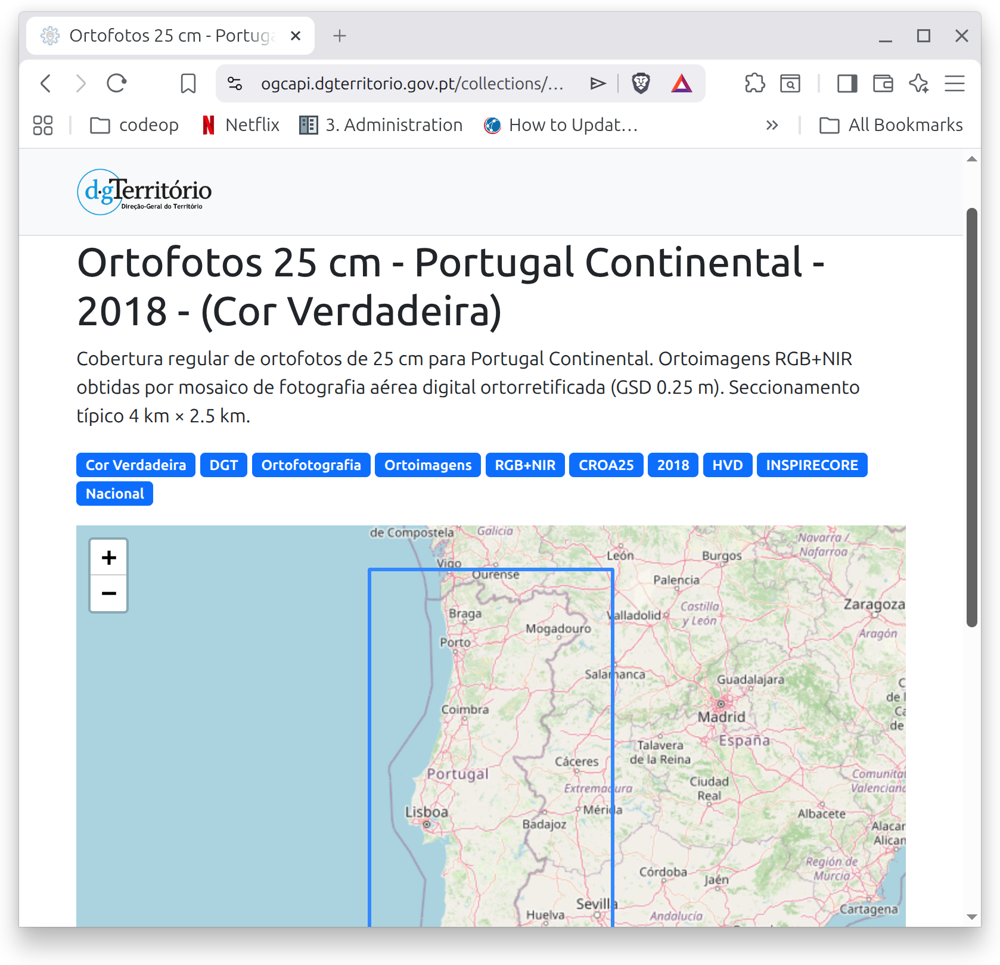
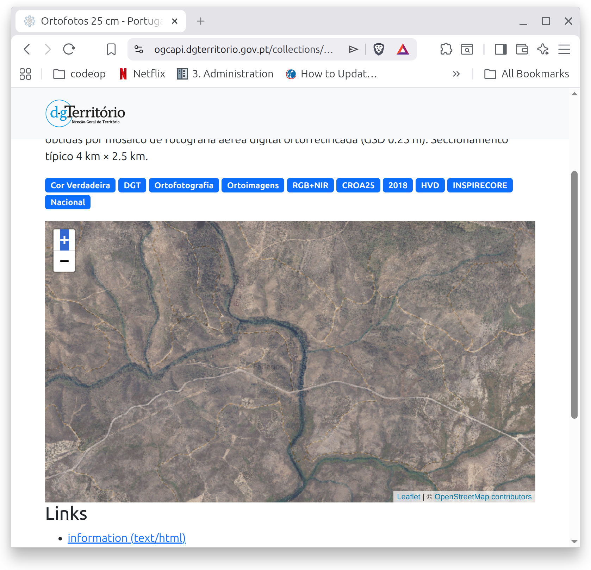
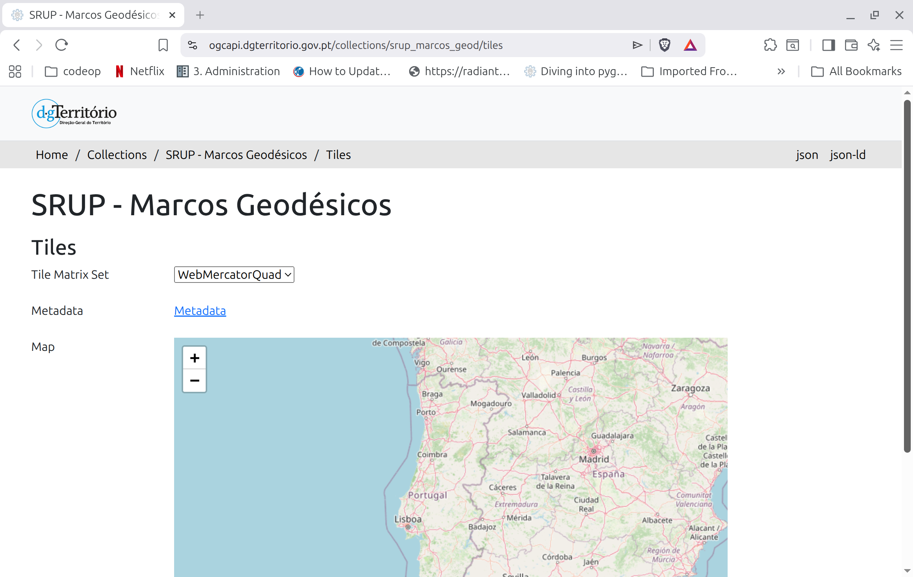
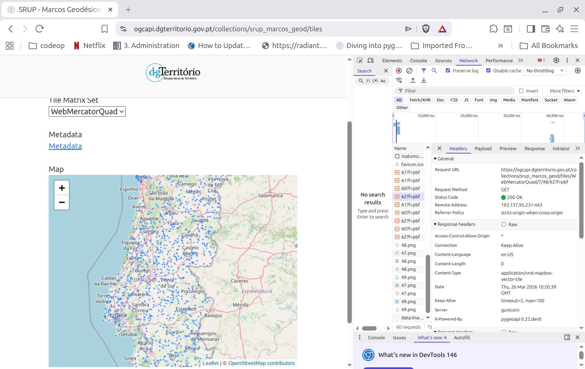
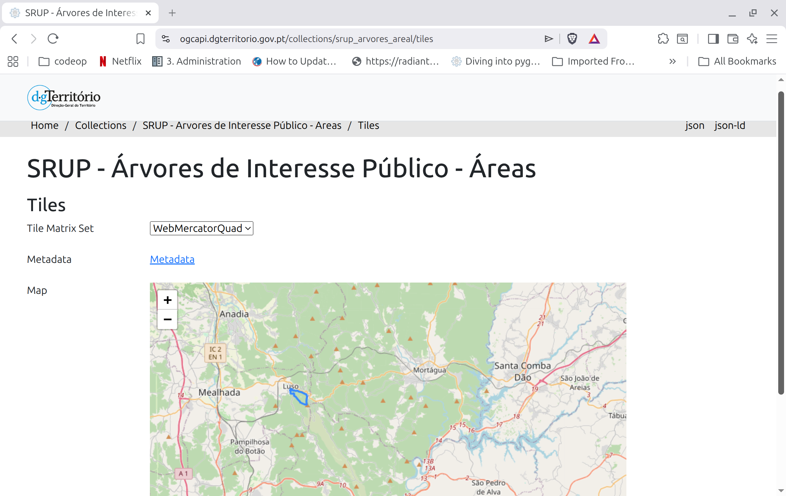

# Perguntas Frequentes

Esta secção compila alguns problemas comuns que podem surgir, e as soluções identificadas. Caso identifiquem outros problemas/soluções que mereçam a pena ser adicionados ou actualizados, podem contribuir utilizando os mecanismos identificados [nesta secção](./contribuir.md).

## Localização
!!! question

    *Porque é que a representação HTML da OGC API - DGT está em inglês?*
    
    A OGC API da DGT suporta português e inglês, de acordo com a preferência do cliente. A pygeoapi segue um mecanismo Standard de HTTP, que procura satisfazer o header [`Accept-Language`](https://www.w3.org/Protocols/HTTP/HTRQ_Headers.html#z12) do pedido enviado pelo cliente. No caso de aceder á API através de um browser verifique se a língua que tem pre-definida é o inglês, o que explicaria obter uma resposta em inglês. 

    !!! tip

        A pygeoapi permite forçar a resposta uma determinada língua, através do parâmetro `lang`. Por exemplo para obter uma resposta em português, independentemente da língua do cliente:

        [https://ogcapi.dgterritorio.gov.pt/?lang=pt](https://ogcapi.dgterritorio.gov.pt/?lang=pt)

## Filtrar Coleções
!!! question

    *A [página de colecções da OGC API da DGT](https://ogcapi.dgterritorio.gov.pt/collections?f=html) tem dezenas de entradas. Como posso filtra-las para encontrar uma entrada específica, por exemplo `caop`?*

    A OGC API da DGT é uma API, desenhada para ser consumida por uma aplicação cliente (como o QGIS). A representação HTML dos endpoints é apenas um exemplo, que permite uma visualização mais simpática que um documento em JSON, mas não apresenta funcionalidades como pesquisas.

    !!! tip

        Ao [criar uma ligação no QGIS com o endpoint da OGC API - Features](./clientes.md#ogc-api-features), é possível filtrar as colecções no servidor usando uma string (por exemplo `caop`).

        

## Paginação
!!! question

    *Sei que esta colecção tem mais de um milhão de registos, mas quando acedo aos dados através do endpoint de OGC API - Features só me aparecem 100. Porquê esta diferença?*

    

    A OGC API usa um mecanismo de paging para evitar sobrecarregar o servidor e o cliente com muitos items. Por defeito, este serviço está configurado para servir 100 items de cada vez. 
    
    !!! tip

        O número de items devolvidos pela OGC API - Features pode ser forçado através do parâmetro `limit`, até chegar ao limite configurado para o servidor. Por exemplo:

        * [https://ogcapi.dgterritorio.gov.pt/collections/crus/items?limit=250](https://ogcapi.dgterritorio.gov.pt/collections/crus/items?limit=250)
        * [https://ogcapi.dgterritorio.gov.pt/collections/crus/items?limit=10](https://ogcapi.dgterritorio.gov.pt/collections/crus/items?limit=10)
        
        
        No caso de o `limit` ultrapassar o limite do servidor, não será apresentado nenhum erro, mas o número máximo de items permitidos será devolvido na resposta.

        Mais detalhes sobre o parâmetro `limit`, incluindo uma explicação de como obter links para navegar através das colecções usando paging, podem ser consultados [nesta secção do Standard](https://docs.ogc.org/is/17-069r4/17-069r4.html#_combinations_of_filter_parameters).

## Velocidade de Acesso
!!! question

    *A resposta do serviço OGC API - Features é muito lenta no meu cliente (por exemplo QGIS). Porquê?*

    As aplicações clientes podem estar a fazer outras operações quando estão a aceder aos items, como por exemplo fazer o rendering da visualização ou criar um cache. Estas operações podem afectar o tempo que o utilizador espera por uma resposta.

    !!! tip

        Para avaliar o tempo real que a OGC API da DGT demora a responder, recomenda-se um processo mais directo de download, como por exemplo usando [curl](https://curl.se/) ou [wget](https://www.gnu.org/software/wget/) na linha de comandos.

            wget 'https://ogcapi.dgterritorio.gov.pt/collections/crus/items?f=json&limit=5000' --2025-04-25 21:35:21--  https://ogcapi.dgterritorio.gov.pt/collections/crus/items?f=json&limit=5000

            Resolving ogcapi.dgterritorio.gov.pt (ogcapi.dgterritorio.gov.pt)... 193.137.95.231 Connecting to ogcapi.dgterritorio.gov.pt (ogcapi.dgterritorio.gov.pt)|193.137.95.231|:443... connected.

            HTTP request sent, awaiting response... 200 OK
            Length: 60693514 (58M) [application/json]
            Saving to: ‘items?f=json&limit=5000’

            items?f=json&limit= 100%[===================>]  57,88M  4,72MB/s    in 12s     
            2025-04-25 21:35:36 (4,64 MB/s) - ‘items?f=json&limit=5000’ saved [60693514/60693514]

    Para melhorar o acesso a dados vetoriais, leia também a [pergunta seguinte](#acesso-eficiente-a-dados-vetoriais).    

## Acesso Eficiente a Dados Vetoriais
!!! question

    *Qual é a melhor forma de aceder a coleções vetoriais no QGIS?*
    
    OGC API - Features está desenhada para permitir pesquisas (e.g.: bounding box, palavra chave, etc), devolvendo apenas a parte dos dados que nos interessa. Se estamos a pedir a totalidade dos dados para efeitos de visualização, a recomendação é usar OGC API - Tiles, que foram desenhadas especificamente para esse propósito e proporcionam uma melhor experiência de navegação (e.g.: zoomin, panning).  

    !!! tip

        As tiles vetoriais retém o acesso aos atributos, permitindo interrogar partes do mapa com a função ’identify’.

        

    No caso de realmente não estarmos interessados na totalidade dos dados, mas apenas uma parte, a recomendação é estabelecer esse filtro antes de aceder á colecção. 

    !!! example

        No exemplo abaixo, mostra-se um pedido da coleção "SRUP - Reserva Ecológica Nacional - Áreas", filtrada pela área de interesse.

        

        

    !!! abstract

    O diagrama abaixo descreve o processo de avaliação do acesso a colecções vetoriais.

    

    Salvo nos caso de colecções que já sabemos de antemão serem muito pequenas, a recomendação é nunca carregar colecções do tipo OGC API - Features sem filtros. Para explorar os dados, e visualizar-los, deve usar-se OGC API - Tiles.

## Visualização de Coleções de Mapas

!!! question

    *Esta coleção do tipo OGC API - Maps não parece apresentar dados. Porquê?*
    
    Algumas coleções do tipo OGC API - Maps apresentam dados muito detalhados (por exemplo pixel de 25cm), que só são visíveis numa escala grande. Se fôr este o caso, experimente a fazer zoom in no cliente, até começarem a aparecer dados.

    !!! example

        No exemplo abaixo, mostra-se o mapa interativo no [endpoint da coleção "Ortofotos 25 cm - Portugal Continental - 2018 - (Cor Verdadeira)"](https://ogcapi.dgterritorio.gov.pt/collections/ortos2018-rgb). Na primeira imagem, o mapa é apresentado à escala de defeito, que mostra todo o país, e não são apresentados dados; na segunda imagem, foi feito zoom in até uma escala mais pequena e já apresentados dados.

        

        

        !!! info

            OGC API - Maps não tem o conceito de zoom levels; no entanto, através dos parâmetros `bbox`, `width` e `height`, é possível calcular uma escala; esta escala pode depois ser traduzida num zoom level por um cliente de mapas, como o LeafLet.

## Visualização de Coleções de Tiles

!!! question

    *Esta coleção do tipo OGC API - Tiles não parece apresentar dados. Porquê?*

    As tiles só são renderizadas quando existe informação. Pode dar-se o caso de que não existe informação para o zoom level especificado, ou para aquela bounding box específica. Se fôr esse o caso, experimente a aumentar o zoom ou a navegar até outra parte do mapa, usando o pan; nalguns casos, pode mesmo ser necessária uma combinação dos dois (zoom + pan).

    !!! example

        No exemplo abaixo, mostra-se o mapa interativo no [endpoint da coleção "SRUP - Marcos Geodésicos"](https://ogcapi.dgterritorio.gov.pt/collections/srup_marcos_geod/tiles). Na primeira imagem, o mapa é apresentado à escala de defeito, que mostra todo o país, e não são apresentados dados; na segunda imagem, foi feito zoom até ao nível 7 e já apresentados dados.

        

        

        Já no caso da coleção ["SRUP - Árvores de Interesse Público - Áreas"](https://ogcapi.dgterritorio.gov.pt/collections/srup_arvores_areal/tiles), há informação apenas nalgumas partes pontuais do mapa. Por exemplo se fizermos zoom para a região do Luso, vamos encontrar uma área.

        

## CRS da Coleção

!!! question

    *Qual é o CRS (Coordinate Reference System) da coleção?*

    O CRS é sempre apresentado na página da coleção. No caso de coleções do tipo OGC API - Features, são suportados múltiplos CRS (ver ["CRS Suportados"](https://dgterritorio.github.io/ogcapi-user/descricao/#crs-suportados)). No caso de coleções do tipo OGC API - Tiles, o Tile Matrix Set (CRS usado para renderizar as tiles) é apresentado no endpoint de tiles (por exemplo: [aqui](https://ogcapi.dgterritorio.gov.pt/collections/cadastro/tiles)); todas as tiles vetoriais são publicadas usando [Web Mercator Quad (EPS:3857)](https://ogcapi.dgterritorio.gov.pt/TileMatrixSets/WebMercatorQuad?f=html).

    !!! tip

        No caso de OGC API - Maps, o CRS é um parâmetro do pedido; no entanto, no caso de este ser omitido o servidor pode optar por enviar um CRS de defeito. No caso das coleções de mapas da DGT, são suportados WGS84 e WebMercator.

